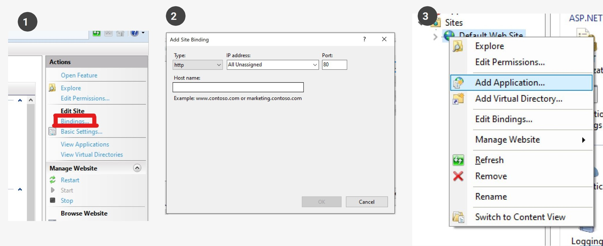

# WMS Swift Windows
Este repositorio tiene las versiones de Swift 3PL para Windows CE, Backoffice de Escritorio y Web.

El repositorio tiene tanto el código como los binarios del software.

## Estructura general de los archivos
* `WmsOnePlan` tiene el Backoffice
  * `WMSOnePlan_Client` es el cliente Win32
  * `WMSOnePlan_WebForm` es el cliente Web ASP.net

# Cliente Win32
## Dependencias
- DevExpress 19.2
- Visual Studio 2017+
- IIS
- .Net Extensibility 3.5 y 4.5+
- ASP.NET 3.5 y 4.5+
- NuGet

Este repoo inicia en el último commit del branch `G-Force@Paris`
## Instalación
### Instalar NuGet y agregar fuente
1. Descargar NuGet
[https://www.nuget.org/downloads](https://www.nuget.org/downloads)
2. Agregar el folder donde esté el ejecutable a la variable de ambiente `Path`
3. Crear un PAT (Personal Access Token)  
[Aquí como generar uno](https://help.github.com/en/github/authenticating-to-github/creating-a-personal-access-token-for-the-command-line), el token tiene que todos los accesos a `repo` y `write:packages`, `read:packages`, y `delete:packages`.  
*Este token es único y no vuele a salir, guardenlo bien*
4. Correr el siguiente comando:
```bash
nuget sources add -name "Github Packages" -Source https://nuget.pkg.github.com/procesoseficientes/ind
ex.json -Username <usuario de github> -Password <PAT>
```

#### Instalación de IIS y ASP.NET
1. Navegar a:
`Control Panel` -> `Programs and Features` -> `Turn Windows features on or off`
2. Chequear `Internet Information Services`
3. Expandir `Internet Information Services`-> `World Wide Web Services` -> `Application Development Features`
4. Chequear ISAPI, ASP.NET 3.5 y 4.6 y .Net Extensibility 3.5 y 4.6
5. Correr el siguiente comando:
```bash
%windir%\Microsoft.NET\Framework64\v4.0.30319\aspnet_regiis.exe -ir
```

#### Configurar Web Service

1. Dentro del IIS Manager, en las acciones del sitio por defecto (Default Web Site) cliquear en `“Bindings”`
2. Agregar el puerto 8088
3. Clic derecho en `Default Web Site` -> `Add Application`
4. Ingresar la siguiente información
  - Alias: `WMSOnePlan_BussinessServices`
  - Path: `<repo>/WmsOnePlan/WmsOnePlan/WMSOnePlan_BussinessServices`
  - Connect As: `Ingresar credenciales de usuario`
5. Agregar aplicación
6. Probar que el servicio funcione navegando a [http://localhost:8088/WMSOnePlan_BusinessServices/Catalogues/WMS_Security.asmx](http://localhost:8088/WMSOnePlan_BusinessServices/Catalogues/WMS_Security.asmx)

#### Visual Studio
1. Abrir Visual Studio como administrador
2. Abrir la solución en `/WmsOnePlan/WmsOnePlan/WmsOnePlan.sln`
3. Dentro del proyecto `WmsOnePlan_Client`  agregar las referencias a los dll en el directorio `/WmsOnePlan/WmsOnePlan/DLLs`
4. Probar correr programa con F5

### Configución con DB
Los configs se pueden descargar desde el sharepoint desde [este link](https://github.com/procesoseficientes/configs).  
Los datos para configurar la DB en el backend está en `WMSOnePlan_BussinessServices/Web.config` en la llave `DESARROLLO`.

`<add key="DESARROLLO" value="Server=`**`<ip del servidor deprueba>`**`,1433;Database=`**`<nombre de la DB deprueba>`**`;User=`**`<usuario>`**`;Pwd=`**`<SQ1MSCM!9>`**`"/>`

Los datos para configurar la DB en el frontend está en `WMSOnePlan_Client/App.config` en las llaves `ConnectionString` y `SERVER_IP`.


Los datos dentro del servidor de prueba son:
- Database: `OP_WMS_ALSERSA`
- User: `sa`
- Pwd: `SQ1MSCM!9`

## Pase de Salida
- Pase de salida alternativo
- Es necesario agregar los siguientes parametros en el `app.config`:  
1. 
```xml
<setting name="PaseDeSalidaAlt" serializeAs="String">
    <value>False</value>
</setting>
```
Eso dentro de la sección `<applicationSettings><WMSOnePlan_Client.My.MySettings>`

2. 
```xml
<add key="PaseDeSalidaAlt" value="False"/>
```
Y eso en `<appSettings>`

Para `Ferco` el valor tiene que ser `True`

## Guía de release
Esta información tambien está en el archivo de la [guía de release](RELEASE_GUIDE.md).

1. Cambiar la configuración de la solución a `Release`
2. Cambiar la versión de Assembly en `WmsOnePlan/WMSOnePlan_Client/My_Proyect/AssemblyInfo.vb`
  - Este es el patrón para las versiones, "`año`.`mes`.`día`.`versión de ese día`"
3. Compilar solución
4. Comprometer y empujar los cambios con una descripción clara de los cambios que tiene ese release
5. Comprimir los archivos en el directorio `WmsOnePlan\WMSOnePlan_Client\bin\Release`
6. Preferiblemente crear un Pull Request de la rama donde se hicieron los cambios a la principal
7. Crear el release en [Github](https://github.com/procesoseficientes/swift-wms-windows/releases)
8. Subir el archivo comprimido de Release en la sección de `Binario` en Github
9. Públicar el Release
